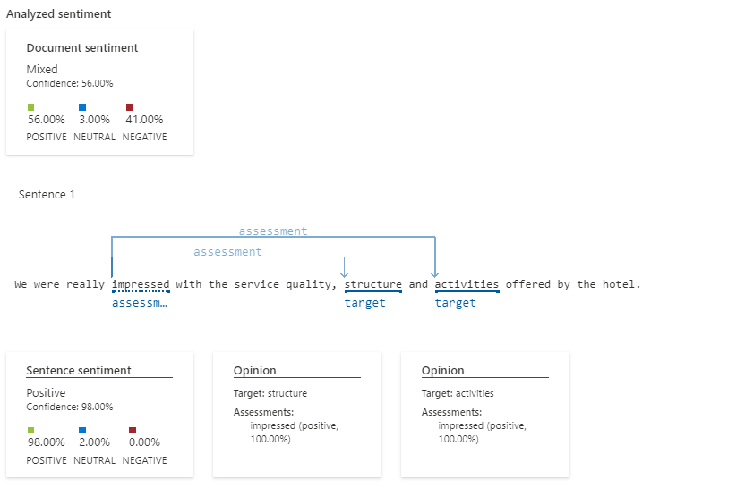
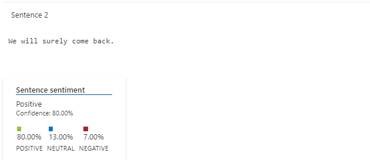

# ai900-language-studio

During this lab, we discover some of Azure's language studio features, including speech to text transcription and sentiment analysis.
Specifically, we are asked to input a sequence of text inputs (reviews or opinions of some sort) and let the model classify its content as one of good, neutral or bad review.

In what follows, the steps necessary to complete the lab are described.

### Step 1 - Create a resource

We should first create a resource group and a resource to define the environment on which we are going to run our experiments.

### Step 2 - Access the Language Studio

The next step is to select the resource we've just created and to access the Azure's Language Studio portal.

### Step 3 - Play with the demo

Once we've reached to the portal, we must select "Classify text", and then "Analyze sentiment and mine opinions".

In the screen that opens, we should select the language in which our text is writen. After that, we can upload an input file containing different texts in the form of reviews.
In this repo, the source file is located inside the [inputs](inputs) folder.

### Step 5 - Run the Demo and Analyze the Results

Finally, check the checkbox and click the Run button to run the demo application.
The results include a [json file](outputs/results.json), and a visual analysis of each sentence.
In this repo, they reside inside the [outputs](outputs) folder, and are illustrated in what follows.

